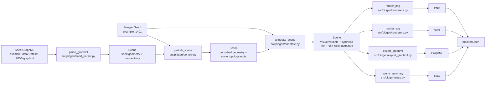
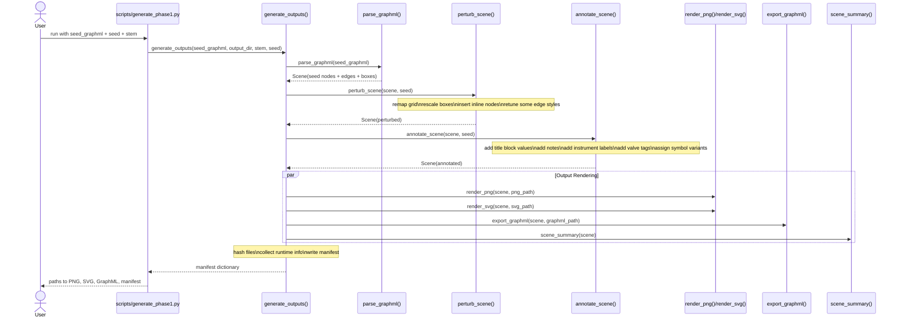
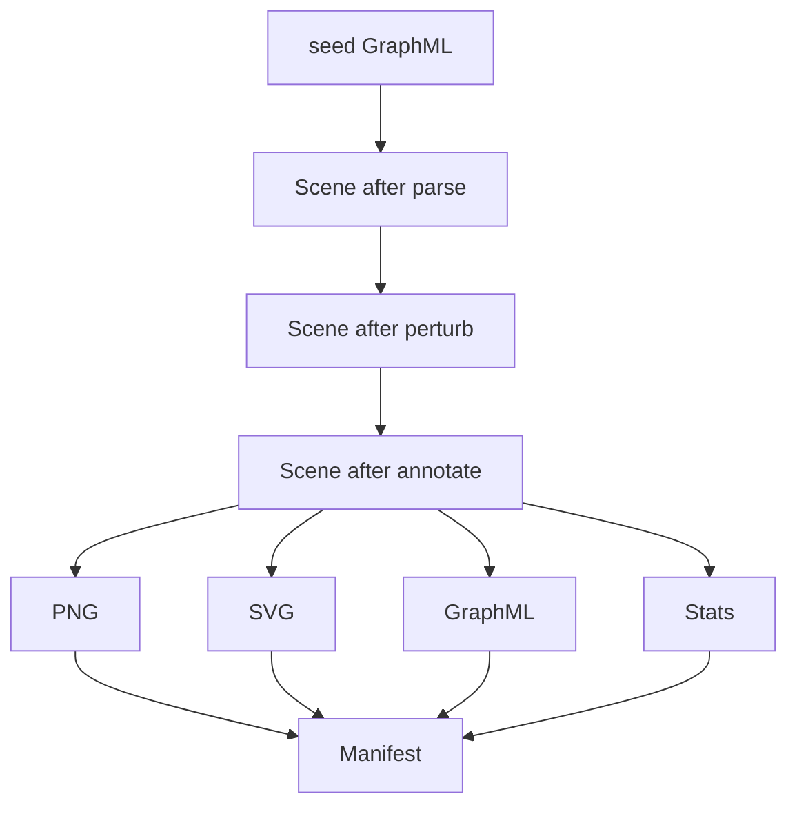

# High-Level Design

This document explains the phase-1 generator as an input-to-output pipeline.

The most important design choice is this:

- we do not generate `PNG`, `SVG`, and `GraphML` independently
- we build one in-memory `Scene`
- every output is produced from that same `Scene`

That is why the outputs stay aligned.

## Inputs And Outputs

### Inputs

1. Seed structure
   - example: `data/Dataset PID/0.graphml`
   - contains node classes, boxes, and graph connectivity

2. Integer seed
   - example: `1401`
   - controls perturbation, symbol choices, and generated text

3. Run parameters
   - output directory
   - file stem

### Outputs

1. Raster sheet
   - `*.png`

2. Vector sheet
   - `*.svg`

3. Annotation graph
   - `*.graphml`

4. Reproducibility manifest
   - `*.manifest.json`
   - contains seed, output paths, hashes, runtime info, and scene stats

## Core Data Object

The central object is `Scene` from `src/pidgen/scene.py`.

`Scene` contains:
- canvas size
- `nodes`
- `edges`
- metadata

Each `Node` has:
- `id`
- `label`
- `bbox`
- metadata such as text and visual variant

Each `Edge` has:
- `source`
- `target`
- style such as `solid` or `non-solid`
- optional metadata such as pipe label text

## Data Flow

## Sequence Diagram

## What Each Stage Actually Changes

### 1. `parse_graphml()`

File: `src/pidgen/seed_parser.py`

What goes in:
- raw GraphML XML

What comes out:
- a `Scene` with seed node boxes and edges

What it does not do:
- no text generation
- no rendering
- no randomness

### 2. `perturb_scene()`

File: `src/pidgen/perturb.py`

What goes in:
- seed `Scene`
- integer seed

What it changes:
- remaps x/y grid positions
- rescales node bounding boxes by class
- inserts a few new inline symbols on long edges
- changes some solid edges to non-solid
- resets the fixed background panel boxes

What comes out:
- a new `Scene` that still looks like the same family, but not like an exact copy

### 3. `annotate_scene()`

File: `src/pidgen/annotate.py`

What goes in:
- perturbed `Scene`
- integer seed

What it adds:
- title block metadata
- notes panel text
- project/unit/drawing identifiers
- node variants
- instrument text
- valve tags
- edge labels such as line specs

Important point:
- this stage mostly adds semantic and visual metadata
- it does not create final image files

### 4. `render_png()` and `render_svg()`

File: `src/pidgen/renderers.py`

What goes in:
- annotated `Scene`

What it does:
- draws the synthetic sheet template
- draws pipes from scene connectivity
- draws symbols from node classes and variants
- draws notes, title block, and labels

Why two renderers exist:
- `PNG` is easy to inspect and use as raster output
- `SVG` preserves vector structure for downstream editing or inspection

### 5. `export_graphml()`

File: `src/pidgen/export_graphml.py`

What goes in:
- the same annotated `Scene`

What it does:
- writes node boxes and edges back to GraphML

Why this matters:
- the annotation graph is synchronized with the rendered page because both come from the same geometry

### 6. `generate_outputs()`

File: `src/pidgen/pipeline.py`

This is the orchestration layer.

It:
- calls parse
- calls perturb
- calls annotate
- calls both renderers
- calls GraphML export
- computes scene stats
- computes SHA256 hashes
- writes manifest JSON

## Artifact Lineage

## Why This Design Is Good For Synthetic Data

Because all outputs come from one scene graph, we get:
- box/image consistency
- deterministic generation with a fixed seed
- easy extension with new symbol classes
- a clean place to add realism later

## Mental Model

If you want a simple mental model, think of the pipeline like this:

1. read one synthetic graph template
2. reshape it a bit
3. decorate it with new engineering-looking metadata
4. draw it twice (`PNG`, `SVG`)
5. export the same structure as `GraphML`
6. record exactly what was generated in a manifest

That is the full input-to-output story.
